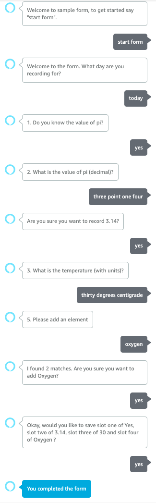

# Alexa Form SDK

## Introduction

This Alexa Form SDK for Node.js provides support for creating skills for dynamic questions and answer forms.

## Features

In order to support flexible and dynamic forms, this sample includes a number of advanced features.

1. Conditional slot support (eg if answered 'yes' to slot one, then prompt for slot two).
4. List disambiguation with support for custom prompts (eg I found 2 matches, did you mean "X")
2. Decimal number support (eg "negative three point one four" as "-3.14") including units of measure (eg 5 percent).
3. Numeric validate with custom prompts (eg require whole numbers, or min <= value <= max)
5. Skipping field collection in a form (eg "skip" to move to next record, or "previous" to go back).
6. Confirmation of form fields before delegating to save action.

## Getting started

### Using the template

Use the ASK CLI to [Create a new skill](https://developer.amazon.com/en-GB/docs/alexa/smapi/ask-cli-intro.html#create-new-skill) with a template-url:

```
ask new --template-url https://github.com/aws-samples/ask-form-template.git
```

You are prompted to choose a method to host your skill's backend resources:

* `Alexa-hosted-skills` (Do not choose this)
* `AWS with CloudFormation` (Choose this to for AWS Lambda with persistence to Amazon DynamoDB)
* `AWS Lambda` (Choose this if you want to deploy to AWS Lambda without AWS CloudFormation)

You will then be warned you about downloading an unofficial template.

Input **Yes** to continue provide a skill name eg. `my-survey`.

```
? Choose a method to host your skill's backend resources:  AWS with CloudFormation
[Warn]: CLI is about to download the skill template from unofficial template https://github.com/aws-samples/ask-form-template.git. Please make sure you understand the source code to best protect yourself from malicious usage.
? Would you like to continue download the skill template?  Yes
? Please type in your skill name: my-survey
? Please type in your folder name for the skill project (alphanumeric):  my-survey
```

Change into your project directory, and list the contents.  You will see the template includes a `lambda` folder with a samples `forms` folder used to generate skill interaction model, as well as `infrastructure` to deploy cloud formation if required.

```
$ cd my-survey
$ tree
.
├── LICENSE.txt
├── README.md
├── ask-resources.json
├── infrastructure
│   └── cfn-deployer
│       └── skill-stack.yaml
├── lambda
│   ├── forms
│   │   └── index.js
│   ├── index.js
│   └── package.json
└── skill-package
    ├── assets
    │   ├── en-US_largeIcon.png
    │   └── en-US_smallIcon.png
    ├── interactionModels
    │   └── custom
    │       └── en-US.json
    └── skill.json
```

You will then be able to deploy this skill into your AWS account.  By default this will be deployed to the `us-east-1` region.

- Update the `.ask-resources.json` to specify a different region.

```shell
$ ask deploy
```

The default invocation is "my survey". Once your skill is deployed, you can [test your skill](https://developer.amazon.com/en-US/docs/alexa/devconsole/test-your-skill.html) in the Alexa developer console.

Following is an example conversation.



### Troubleshooting

- If you are getting the following error during ```ask deploy```, then you already have the dynamo db table created with the name my-survey :
```
[Error]: The CloudFormation deploy failed for Alexa region "default": AlexaPersistentAttributesTable[AWS::DynamoDB::Table]  DELETE_COMPLETE(Resource deleted. For detailed reasoning, please check the "events" tab in the AWS console for CloudFormation stackId <STACK-ID>)
```
To resolve this issue you can fo to my-survey/infrastructure/cfn-deployer/skill-stack.yaml and change the name of the ```PersistentAttributeTableName``` default value from my-survey.
- If you are getting the following CLI error during deployment, it might be due to the ask profile settings ;
```
[Error]: CliError: Skill package src is not found in ask-resources.json.
```
Go to my-survey/ask-resources.json and check the profile to see if the profile used for deployment is present in this. If not add the profile use for deployment to this file.

### Adding to an existing skill.

If you already have an existing skill, you can extend it with the following three steps.

1. Install library

Install the package as a dev dependency with: 

```shell
$ npm install ask-form-sdk
```

2. Update lambda

Add request handlers for `DecimalIntentHandler` and `FormListHandler`.  

The `FormListHandler` class also has methods:

* `handlerNext` - Move to next item in the form
* `handlePrevious` - Move to previous item in the form
* `handleUserEvent` - Handle APL touch event
* `handleFormReview` - Display review screen

These can be called from other intents eg `AMAZON.NextIntent` as shown below.

```javascript
// Import the decimal and form list handler
const { DecimalIntentHandler, FormListHandler } = require('ask-form-sdk');

// Import your form definitions
const { forms } = require('./forms');

// Add an handler to optionally load user from session or API
const ApiUserHandler = {
    async getUser(handlerInput) {
        const deviceId = handlerInput.requestEnvelope.context.System.device.deviceId;
        if (handlerInput.serviceClientFactory) {
            const upsServiceClient = handlerInput.serviceClientFactory.getUpsServiceClient();
            return {
                username: await upsServiceClient.getProfileName(),
                timeZone: await upsServiceClient.getSystemTimeZone(deviceId),
            };
        }
    },
    canHandle() {
        // Optionally add logical to check if there is a valid user for form
        return true;
    }
};

// Create the forms handler passing the api user handler
const formsHandler = new FormListHandler(forms, ApiUserHandler);

// Welcome intent
const LaunchRequestHandler = {
    canHandle(handlerInput) {
        return handlerInput.requestEnvelope.request.type === 'LaunchRequest';
    },
    handle(handlerInput) {
        const speakOutput = 'Welcome to sample form, to get started say "start form".';
        return handlerInput.responseBuilder
            .speak(speakOutput)
            .reprompt(speakOutput)
            .getResponse();
    }
};

// Next handler calls into forms handler
class NextHandler {
    constructor(formsHandler) {
        this.formsHandler = formsHandler;
    }
    canHandle(handlerInput) {
        return handlerInput.requestEnvelope.request.type === 'IntentRequest'
            && handlerInput.requestEnvelope.request.intent.name === 'AMAZON.NextIntent'
            && this.formsHandler.isCurrent(handlerInput);
    }
    handle(handlerInput) {
        return this.formsHandler.handleNext(handlerInput)
    }
};

// Add request handlers for (default intent handlers omitted for clarify)
const requestHandlers = Alexa.SkillBuilders.custom()
    .addRequestHandlers(
        // LaunchRequestHandler,
        new DecimalIntentHandler(formsHandler),
        formsHandler,
        new NextHandler(formsHandler),
        SaveFormIntentHandler, // Delete to SaveFormIntentHandler
        ErrorHandler,
    );

// Optionally add other API or persistence handlers, then return lambda
exports.handler = requestHandlers.lambda();
```

3. Add forms

When creating the `FormListHandler` class you pass a list of forms, these include properties and optional validation as illustrated with this simple two slot form below.

```javascript
const { WholeNumberValidation } = require('ask-form-sdk');

const temperature = {
    name: 'TemperatureIntent',
    title: 'Temperature Form',
    prompt: (slotNumber) => slotNumber === 0 ? 'Welcome to the form. ' : '',
    slots: [
        {
            index: 1,
            name: 'slot_three',
            type: 'AMAZON.NUMBER',
            prompt: 'What is the temperature (with units)?',
            reprompt: 'What temperature?',
            required: true,
            validation: [
                new WholeNumberValidation('Please specify temperature as a whole number.'),
            ],
        },
        {
            index: 2,
            name: 'slot_three_units',
            type: 'DECIMAL_UNITS', // Can we just use the same general UNITS type?
            prompt: 'For what units?',
            reprompt: 'Is that in "Celsius" or "Fahrenheit"?',
            required: false,
            options: {
                'C': [
                    'Celcius',
                    'degree celcius',
                    'degrees celcius',
                    'centigrade',
                ],
                'F': [
                    'Fahrenheit',
                    'degree fahrenheit',
                    'degrees fahrenheit',
                ],
            },
            conditional: [{
                name: 'slot_three',
                empty: false, // Conditional if the slot_three is not empty
            }],
        },
    ],
    confirmation: () => {
        return `Okay, would you like to save the temperature?`;
    },
    delegate: 'SaveFormIntent',
    samples: [
        'record temperature of {slot_three} {slot_three_units}',
        'record temperature of {slot_three}',
        'record temperature',
    ],
};

export const forms = [temperature];
```

### Customising the Form and Slots definition

The form has a number of slots which you can configure.

* `name`: unique name for the form.
* `title`: unique title displayed on the card.
* `slots`: the list of properties for each slot (see below)
* `prompt(slotNumber)`: a function to return the prompt to display when beginning the form.
* `confirmation(slots, slotValues)`: a function to return the prompt when completing the form.
* `delegate`: the intent name to delegate to after confirmation eg "StartFormIntent".
* `samples`: the list of samples heard to start form eg "start form".
* `reviewPrompt(aplSupported, slotValues)`: optional function to return a prompt after the review page is displayed.
* `aplProperties`:
  - `previousDisplayText`: Optional text to prefix for previous item in list eg "Previous" 
  - `nextDisplayText`: Optional text to prefix for next item in list eg "Next"
  - `endOfFormText`: Optional text to display for the end of the list eg "End of form".

Each slot has a series of properties.

* `name`: unique name for the slot.
* `index`: optional number for the slot.
* `type`: the Alexa [Slot Type](https://developer.amazon.com/en-US/docs/alexa/custom-skills/slot-type-reference.html) 
* `options`: for custom slots, you can provide a list of options.
* `prompt`: The prompt to ask user.
* `reprompt`: The re-prompt message for user.
* `required`: Specify boolean (true/false) if the field is required.
* `conditional`: Optional list of conditional settings for this slot
  - `name`: slot name to match condition
  - `empty`: Optional boolean (true/false) to make on an empty or non-empty field.
  - `value`: Optional value to match for slot.

You can customize the form and add new fields and delete/modify existing fields as required by the skill. This can be done by editing the index.js file under lambda/forms folder.

### Code Generating the model

Once you have made changes or additions to the form definition, you can code generate the model file(en-US). In order to do this, you need to install the ask-form-sdk. The following will install the SDKs globally for code generation, you can also access run locally via `node_modules/.bin/ask-form-codegen` command.

```shell
$ cd my-survey
$ npm install -g ask-form-sdk
```

The code generation tool can take in the following options:

* -f : the path to forms
* -s : the path to the source model json
* -t : the path to the target model json
* -i : invocation name for skill. Provide this argument when the model is created from scratch.

There are 2 options for code generation.

* Have the new form changes applied on top of the existing model file. This can be done by providing the existing model file as the source file:

```shell
$ ask-form-codegen -f lambda/forms/ -t skill-package/interactionModels/custom/en-US.json -s skill-package/interactionModels/custom/en-US.json
```

* Have the model code generated from scratch. To generate the model file form scratch, provide the invocation name and do not provide any source model files :

```shell
$ ask-form-codegen -f lambda/forms/ -t skill-package/interactionModels/custom/en-US.json -i 'my survey'
```

This will create a model file with the fields in the form along with few other intents required by the skill.

## Tests

The `examples` folder defines a series of typescript test specifications using the [ask-sdk-test](https://github.com/taimos/ask-sdk-test) framework that show cases some of the various features mentioned above.

## Authors

* [Julian Bright](http://github.com/brightsparc)
* [Christy maria Mathew](http://github.com/christy-maria)

## Security

See [CONTRIBUTING](CONTRIBUTING.md#security-issue-notifications) for more information.

## License

This library is licensed under the MIT-0 License. See the LICENSE.txt file.